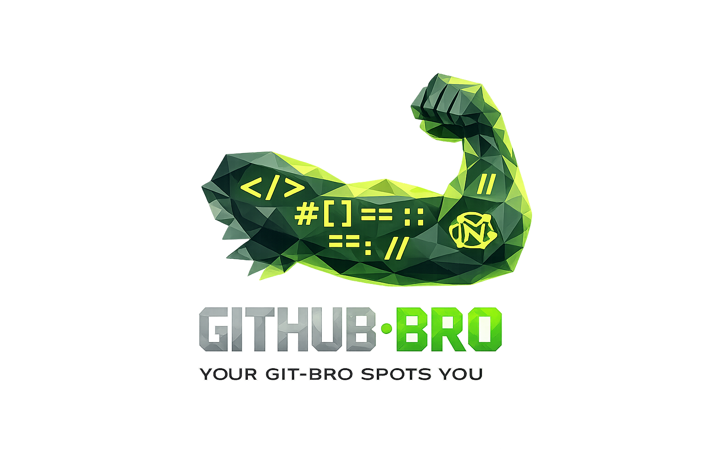
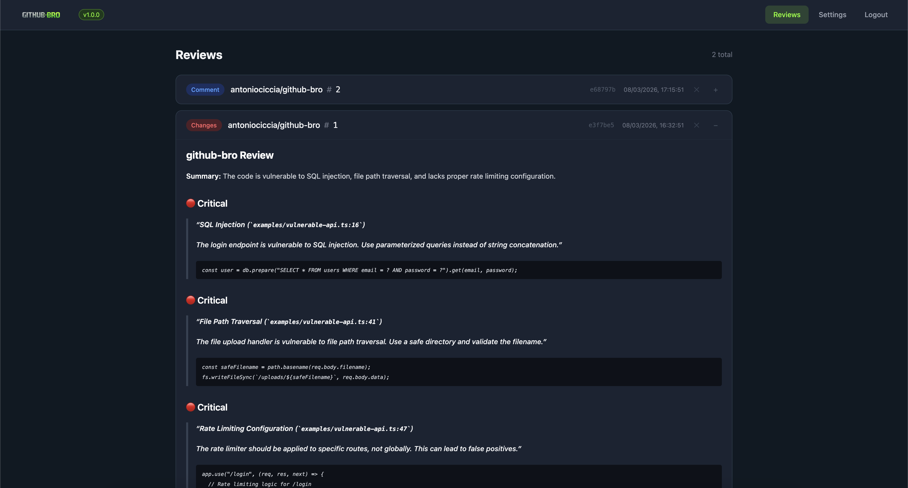
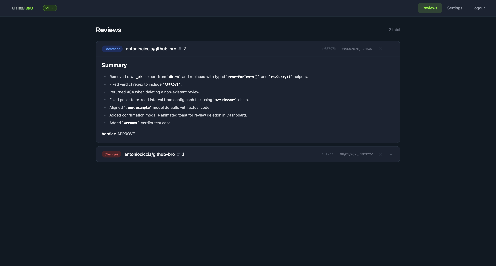

<p align="center">
  
</p>

<h1 align="center">github-bro</h1>

<p align="center"><strong>Your Git-Bro that spots you on every PR.</strong></p>

github-bro is a self-hosted AI code reviewer that automatically analyzes your GitHub pull requests and posts detailed reviews. It catches security vulnerabilities, bugs, performance issues, and bad practices before they reach production.

Runs a **local LLM** by default (private, no data leaves your machine). Optionally switch to **cloud** via [OpenRouter](https://openrouter.ai) for faster results.

---

## Features

- **Automatic PR reviews** — triggered by GitHub webhooks or polling
- **Local-first** — runs Qwen2.5-Coder-7B locally by default, 100% private
- **Apple Metal GPU** — auto-detects Metal for fast inference on Apple Silicon
- **Cloud option** — switch to OpenRouter (50+ models) from the Settings UI
- **Smart token management** — uses tiktoken for accurate token counting and diff truncation
- **Markdown reviews** — renders code blocks, tables, and formatting in the dashboard
- **Pagination & filtering** — browse reviews by page and filter by project
- **Real PR reviews** — posts as a GitHub review or comment with verdict
- **Self-review fallback** — automatically posts a comment when reviewing your own PR (GitHub blocks self-reviews)
- **Local-only mode** — optionally store reviews only in github-bro without posting to GitHub
- **Provider toggle** — switch between Local and Cloud from the UI, no restart needed
- **JWT authentication** — password-protected UI with bcrypt + JWT
- **Delete reviews** — manage reviews directly from the dashboard
- **Docker-ready** — one command to deploy

## Architecture

```
                         GitHub Webhook / Polling
                              |
                     PR opened / updated
                              |
                              v
                    +-------------------+
                    |    github-bro      |
                    |   (Express/TS)    |
                    +--------+----------+
                             |
              +--------------+--------------+
              |              |              |
              v              v              v
        +---------+    +-----------+   +-----------+
        |  SQLite |    |  GitHub   |   |    LLM    |
        | reviews |    |   API     |   | Provider  |
        +---------+    +-----+-----+   +-----+-----+
                             |               |
                        fetch diff      analyze code
                             |               |
                             v               v
                       +-------------------------+
                       |   POST review/comment   |
                       |   or store locally      |
                       +-------------------------+

  LLM Provider:
  +------------------+     +------------------+
  |   Local Worker   |     |   OpenRouter     |
  |   (Python/GGUF)  | OR  |   (cloud)        |
  |   100% private   |     |   50+ models     |
  +------------------+     +------------------+
```

## What it catches

| Category | Examples |
|----------|---------|
| **Security** | SQL injection, XSS, RCE, `eval()`, hardcoded secrets, insecure auth |
| **Performance** | Sync operations in async context, N+1 queries, memory leaks |
| **Code quality** | Missing error handling, unused imports, naming issues |
| **Best practices** | Missing input validation, improper auth patterns, untyped env vars |

## Review format

```markdown
## github-bro Review

**Summary:** Found 2 security issues and 1 performance concern

### 🔴 Critical
> **SQL Injection** (`src/users.ts:8`)
>
> User input concatenated into query without sanitization.
> ```suggestion
> db.prepare("SELECT * FROM users WHERE name = ?").get(user)
> ```

### 🟡 Warning
> **Blocking I/O** (`src/auth.ts:13`)
>
> bcrypt.compareSync blocks the event loop. Use bcrypt.compare instead.

### 🟢 Suggestion
> **Env validation**
>
> Ensure JWT_SECRET is defined at startup.

**Verdict:** REQUEST_CHANGES

-- github-bro
```

## Screenshots

<p align="center">
  
</p>
<p align="center"><em>PR #1 — Security vulnerabilities detected: SQL injection, path traversal, rate limiting bypass</em></p>

<br/>

<p align="center">
  
</p>
<p align="center"><em>PR #2 — Clean refactor, no issues found. Verdict: APPROVE</em></p>

---

## Quick start

### 1. Clone and configure

```bash
git clone https://github.com/antoniociccia/github-bro.git
cd github-bro
cp .env.example .env
```

Edit `.env`:

```env
GITHUB_TOKEN=ghp_your_token          # GitHub PAT with repo scope
GITHUB_WEBHOOK_SECRET=your-secret    # Optional: webhook signature verification
```

### 2. Run with Docker

```bash
docker compose --profile local up -d
```

This starts both github-bro and the local LLM worker. On first startup, the worker downloads **Qwen2.5-Coder-7B-Instruct** from HuggingFace (~4.5GB) and caches it in `./models/`.

### 2b. Run natively (recommended on Apple Silicon)

For Metal GPU acceleration on Mac:

```bash
# Backend
npm install && npm run build:server && npm run build:ui
node dist/index.js

# Worker (in a separate terminal)
cd worker
python -m venv .venv && source .venv/bin/activate
bash setup.sh   # auto-detects Metal/CUDA/CPU
python server.py
```

The `setup.sh` script automatically detects your GPU:
- **CUDA** (NVIDIA) — compiles with `DGGML_CUDA=on`
- **Metal** (Apple Silicon) — compiles with `DGGML_METAL=on`
- **CPU** — fallback, no GPU flags

### 3. First login

Open `http://your-server:3010` in a browser. On first visit you'll be prompted to **create an account** (email + password). This enables JWT authentication on all API endpoints. The password is hashed with bcrypt and stored in the local SQLite database.

### 4. Start reviewing

github-bro polls `antoniociccia/github-bro` by default. Change the repos in **Settings > GitHub > Repositories to poll**.

To use webhooks instead:

1. Go to your repo **Settings > Webhooks > Add webhook**
2. **Payload URL:** `https://your-server:3010/webhook`
3. **Content type:** `application/json`
4. **Secret:** same value as `GITHUB_WEBHOOK_SECRET`
5. **Events:** select **Pull requests**

---

## Switching LLM provider

Switch between Local and Cloud from the **Settings** page:

- **Local** (default) — uses the bundled worker, no API key needed
- **Cloud** — shows API Key and Model fields, uses OpenRouter

An **Advanced** checkbox reveals the Base URL field for custom endpoints.

Changes apply immediately — no restart required.

### Cloud mode

To use OpenRouter, switch to Cloud in Settings and enter your API key. Or set it in `.env`:

```env
OPENROUTER_API_KEY=sk-or-v1-...
OPENROUTER_MODEL=qwen/qwen3.5-35b-a3b
LLM_BASE_URL=https://openrouter.ai/api/v1
```

---

## Local LLM configuration

### Default model

**Qwen2.5-Coder-7B-Instruct Q4_K_M** — ~4.5GB, optimized for code review. Best quality reviews among local models tested. Runs great on Apple Silicon with Metal GPU acceleration.

Swap it for any GGUF model by setting these in `.env`:

```env
MODEL_REPO=Qwen/Qwen2.5-Coder-7B-Instruct-GGUF
MODEL_FILE=qwen2.5-coder-7b-instruct-q4_k_m.gguf
CONTEXT_SIZE=16384
GPU_LAYERS=-1
```

Other tested models:

| Model | Size | Speed | Quality |
|-------|------|-------|---------|
| **Qwen2.5-Coder-7B** | 4.5GB | ~50s/review | Best |
| **Phi-4-mini** | 2.5GB | ~15s/review | Good |

### GPU acceleration

| Platform | Backend | How |
|----------|---------|-----|
| **Apple Silicon** | Metal | Run worker natively with `setup.sh`, or set `LLAMA_BACKEND=metal` |
| **NVIDIA GPU** | CUDA | `docker build --build-arg LLAMA_BACKEND=cuda ./worker` |
| **CPU only** | CPU | Default in Docker (no GPU passthrough on macOS Docker) |

> **Note:** Docker on macOS cannot access Metal GPU. For best performance on Mac, run the worker natively.

### Token counting

github-bro uses [tiktoken](https://github.com/openai/tiktoken) for accurate token counting. Diffs are automatically truncated using binary search to fit within the model's context window while maximizing the amount of code reviewed.

### Worker auth

When `APP_SECRET` is set in `.env`, github-bro signs short-lived JWTs to authenticate with the worker. The worker verifies them. Set the same `APP_SECRET` for both services (docker-compose handles this automatically).

---

## GitHub posting

Control how reviews are posted from **Settings > GitHub**:

- **Post to GitHub: ON** (default) — reviews are posted on the PR and stored locally
- **Post to GitHub: OFF** — reviews are stored locally only, visible in the dashboard

> **Note:** GitHub does not allow a user to post a formal review on their own PR. When this happens, github-bro automatically falls back to posting a regular PR comment instead.

---

## Authentication

github-bro uses password-based JWT authentication:

- **First visit** — the UI shows a "Create Account" form (email + password)
- **Subsequent visits** — login with your credentials
- **JWT tokens** — valid for 7 days, stored in `localStorage`
- **Protected endpoints** — all `/api/*` routes require a valid token (except `/api/auth-required`, `/api/setup`, `/api/login`)
- **Public endpoints** — `/webhook`, `/health`, and static UI files remain open

If no account has been created, all API endpoints are open (backward compatible).

---

## Testing

```bash
npm install
npm run build:server
npm test
```

55 tests covering database operations, JWT auth, token counting, diff truncation, GitHub integration, and polling logic. CI runs automatically on pull requests via GitHub Actions.

---

## Dry run

Test the review pipeline without a real PR:

```bash
npm install
npm run dry-run
```

Sends a fake diff to the LLM and outputs the formatted review to stdout.

---

## Configuration reference

### Environment variables

| Variable | Description | Default |
|---|---|---|
| `GITHUB_TOKEN` | GitHub PAT with `repo` scope | **required** |
| `GITHUB_WEBHOOK_SECRET` | Webhook signature secret | optional |
| `OPENROUTER_API_KEY` | OpenRouter API key | not needed (local mode) |
| `OPENROUTER_MODEL` | Model identifier | `local` |
| `LLM_BASE_URL` | LLM API endpoint | `http://worker:8000/v1` |
| `APP_SECRET` | Shared secret for JWT signing and worker auth | auto-generated |
| `PORT` | Server port | `3010` |
| `POLL_REPOS` | Repos to poll (`owner/repo`, comma-separated) | `antoniociccia/github-bro` |
| `POLL_INTERVAL` | Polling interval in seconds | `300` |
| `CONTEXT_SIZE` | Context window for token truncation | `16384` |

### Local worker

| Variable | Description | Default |
|---|---|---|
| `MODEL_REPO` | HuggingFace repo ID | `Qwen/Qwen2.5-Coder-7B-Instruct-GGUF` |
| `MODEL_FILE` | GGUF filename | `qwen2.5-coder-7b-instruct-q4_k_m.gguf` |
| `CONTEXT_SIZE` | Context window size | `16384` |
| `GPU_LAYERS` | Layers offloaded to GPU (`-1` = all) | `-1` |
| `LLAMA_BACKEND` | Force GPU backend: `metal`, `cuda`, or `cpu` | auto-detected |
| `APP_SECRET` | Must match github-bro's `APP_SECRET` | optional |

### UI settings (stored in SQLite)

| Setting | Description | Default |
|---|---|---|
| `llm_provider` | `local` or `cloud` | `local` |
| `post_to_github` | Post reviews on GitHub PRs | `true` |
| `poll_repos` | Repos to watch | `antoniociccia/github-bro` |
| `poll_interval` | Polling interval in seconds | `300` |

### Supported cloud models (via OpenRouter)

Any model on [OpenRouter](https://openrouter.ai/models), including:
- `qwen/qwen3.5-35b-a3b` (cheap, fast)
- `anthropic/claude-sonnet-4-6` (best quality)
- `meta-llama/llama-3.1-8b-instruct` (open source)

---

## Project structure

```
github-bro/
├── src/
│   ├── index.ts        # Express server, webhook handler
│   ├── api.ts          # API routes (auth + config + reviews)
│   ├── auth.ts         # JWT middleware and token signing
│   ├── github.ts       # GitHub API (fetch diff, post review)
│   ├── reviewer.ts     # LLM client, tiktoken-based truncation
│   ├── db.ts           # SQLite (reviews, config, users)
│   ├── poller.ts       # Polling mode
│   ├── dry-run.ts      # Local test with fake diff
│   ├── seed-demo.ts    # Seed a demo review into the database
│   └── __tests__/      # Unit tests (vitest)
├── ui/
│   └── src/
│       ├── App.tsx      # Auth-aware shell
│       ├── api.ts       # apiFetch helper (auto Bearer token)
│       └── pages/
│           ├── Dashboard.tsx  # Review list with markdown, pagination, filters
│           ├── Settings.tsx   # Provider toggle + config
│           └── Login.tsx      # Login / setup form
├── worker/
│   ├── server.py       # FastAPI + llama-cpp-python + JWT auth
│   ├── setup.sh        # Auto-detect GPU backend (Metal/CUDA/CPU)
│   ├── requirements.txt
│   └── Dockerfile
├── .github/workflows/
│   ├── docker.yml      # Build & push images to ghcr.io
│   └── test.yml        # Run tests on PRs
├── docker-compose.yml
├── Dockerfile
└── .env.example
```

## Tech stack

| Component | Technology |
|-----------|-----------|
| Server | TypeScript, Express 5, dotenv |
| GitHub integration | Octokit |
| LLM client | OpenAI SDK (compatible with local worker + OpenRouter) |
| Token counting | tiktoken (accurate BPE tokenization) |
| Authentication | bcrypt, jsonwebtoken (JWT) |
| Database | better-sqlite3 |
| UI | React, Tailwind CSS, react-markdown |
| Testing | vitest |
| Local inference | Python, FastAPI, llama-cpp-python |
| GPU support | Metal (Apple Silicon), CUDA (NVIDIA) |
| Default model | Qwen2.5-Coder-7B-Instruct (GGUF Q4_K_M, ~4.5GB) |
| Containerization | Docker, multi-stage builds |

## License

[MIT](LICENSE)
